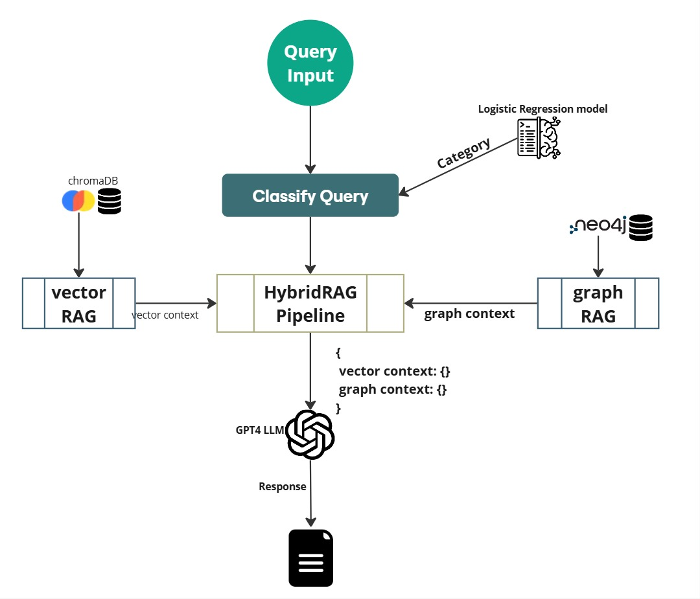

# HybridRAG

## Text Information Extraction System for Georock Research Papers

## Overview

HybridRAG is an advanced Retrieval-Augmented Generation system designed specifically for extracting and reasoning with geochemical information from scientific literature. By integrating vector-based semantic retrieval with graph-based structured knowledge extraction, HybridRAG significantly improves the accuracy, relevance, and reasoning capabilities of information retrieval from complex scientific texts.

The system dynamically selects retrieval strategies based on query classification, enabling more precise and context-aware responses across a spectrum of query types, from explicit fact retrieval to complex reasoning tasks.

## Working Demo

**Try it out:** [Live Demo](https://georag-app.streamlit.app/)
## Key Features

- **Query Classification**: Automatically categorizes queries into Explicit Facts, Implicit Reasoning, Hidden Rationale, or Interpretable Rationale to optimize retrieval strategy
- **VectorRAG**: Utilizes dense embeddings and similarity search for semantic text retrieval
- **GraphRAG**: Leverages knowledge graphs for structured relationship extraction and reasoning
- **Dynamic Retrieval Selection**: Applies the optimal retrieval method based on query characteristics
- **Context Fusion**: Merges semantic and structured knowledge for comprehensive response generation
- **Scientific Domain Adaptation**: Specifically optimized for geochemistry domain knowledge

## System Architecture



## Installation

```bash
# Clone the repository
git clone https://github.com/username/HybridRAG.git
cd HybridRAG

# Create and activate virtual environment
python -m venv venv
source venv/bin/activate  # On Windows: venv\Scripts\activate

# Install dependencies
pip install -r requirements.txt

# Set up Neo4j (required for GraphRAG)
docker pull neo4j:latest
docker run -p 7474:7474 -p 7687:7687 -e NEO4J_AUTH=neo4j/password neo4j:latest
```

## Requirements

```
pip install -r requirements.txt
```

## Data Preprocessing

Before running the system, preprocess your corpus of geochemical research papers:

```bash
# Process PDFs and extract text
python src/preprocessing/extract_text.py --input_dir /path/to/pdfs --output_dir /path/to/output

# Clean and chunk text
python src/preprocessing/clean_and_chunk.py --input_dir /path/to/output --output_dir /path/to/chunks

# Generate embeddings
python src/preprocessing/generate_embeddings.py --input_dir /path/to/chunks --output_dir /path/to/embeddings

# Build knowledge graph
python src/graph/build_knowledge_graph.py --input_dir /path/to/chunks --neo4j_uri bolt://localhost:7687
```


## Query Examples

### Explicit Fact Retrieval
```
What is the isotopic fractionation of Uranium?
```

### Implicit Reasoning
```
How does mineral composition affect element diffusion?
```

### Hidden Rationale
```
Why do certain isotopes exhibit fractionation under pressure?
```

### Interpretable Rationale
```
What factors influence isotopic fractionation trends?
```

## Evaluation

HybridRAG has been rigorously evaluated against a baseline RAG system using the following metrics:

### Response Quality Metrics
- Factual Correctness
- Semantic Similarity
- Non-LLM String Similarity
- BLEU Score
- ROUGE Score

### Retrieval-Based Metrics
- Context Precision
- Context Recall
- Context Entities Recall
- Noise Sensitivity
- Faithfulness

To run the evaluation suite:

```bash
python src/evaluation/evaluate.py --hybrid_results path/to/hybrid_results --baseline_results path/to/baseline_results
```

## Performance Results

HybridRAG outperforms the baseline RAG system in:

- **Factual Correctness**: Higher accuracy in complex query responses
- **Semantic Similarity**: Better alignment with reference answers
- **Context Entities Recall**: More comprehensive entity retrieval
- **Noise Sensitivity**: Lower rate of incorrect claims
- **Faithfulness**: Stronger alignment between responses and retrieved contexts

For detailed performance metrics, see the [evaluation report](docs/evaluation_report.md).


## Future Work

- Integration of domain-specific geochemical ontologies
- Refinement of query classification models with reinforcement learning
- Optimization of retrieval fusion techniques
- Enhanced explainability and traceability of responses
- Expansion to additional scientific domains

## Citation

If you use HybridRAG in your research, please cite:

```
@report{uwaish2025hybridrag,
  title={Building a System for Text Information Extraction from Georock Research Papers},
  author={Uwaish, Mohd},
  institution={University of Göttingen},
  year={2025}
}
```

## License

This project is licensed under the MIT License - see the LICENSE file for details.

## Acknowledgments

- University of Göttingen for research support
- Georock Database for providing the corpus of geochemical research papers
- Contributors to the open-source libraries used in this project
